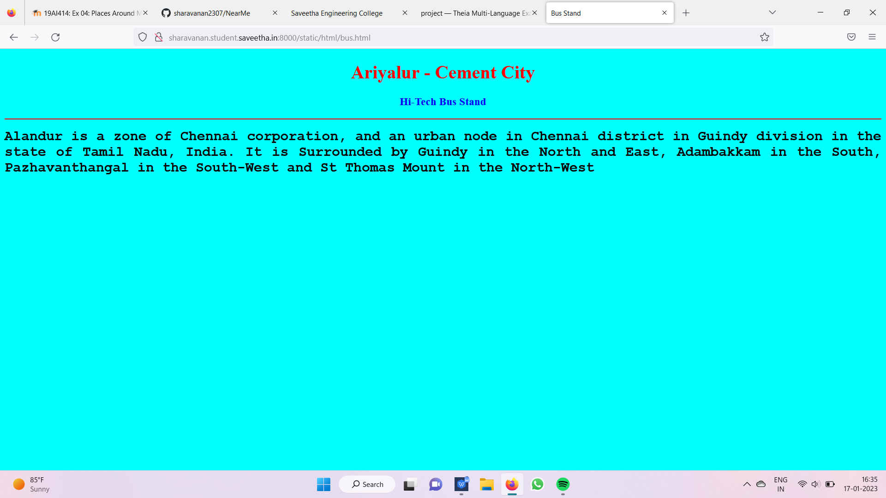
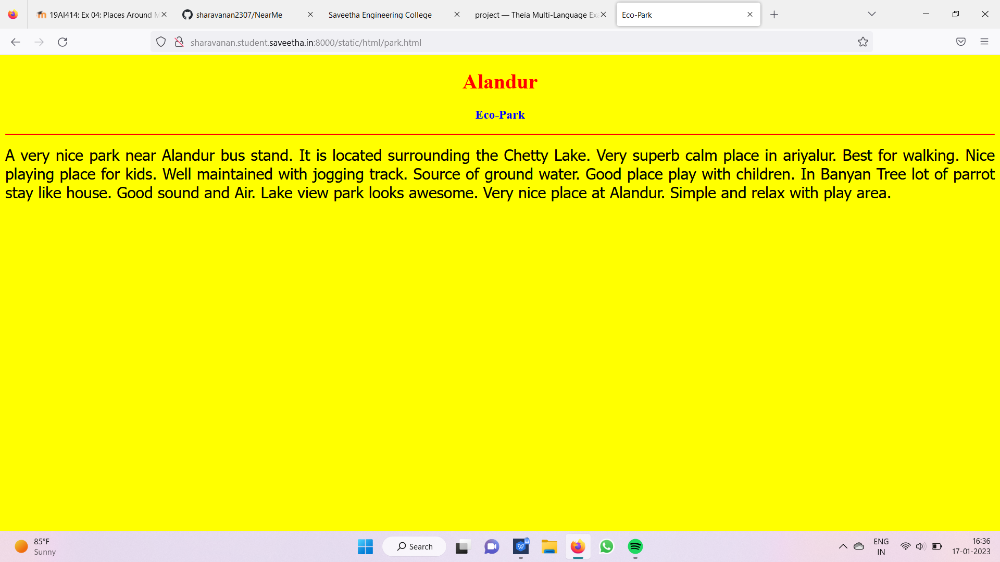
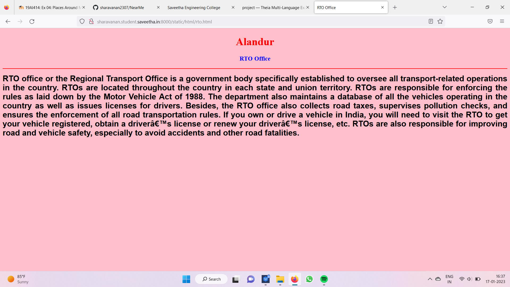
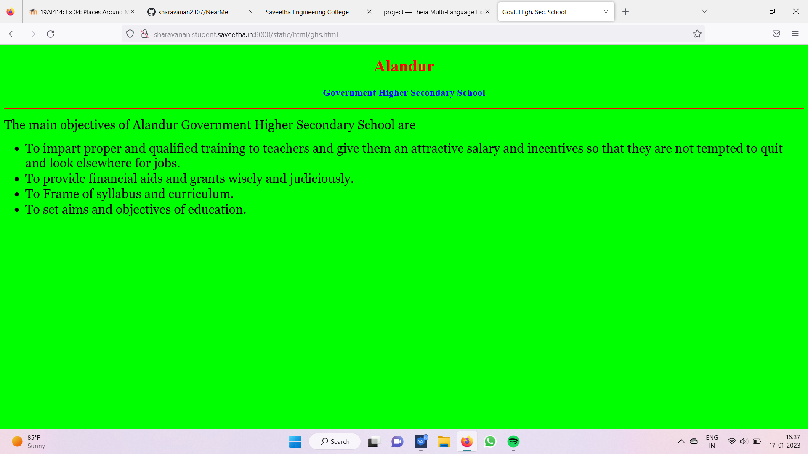
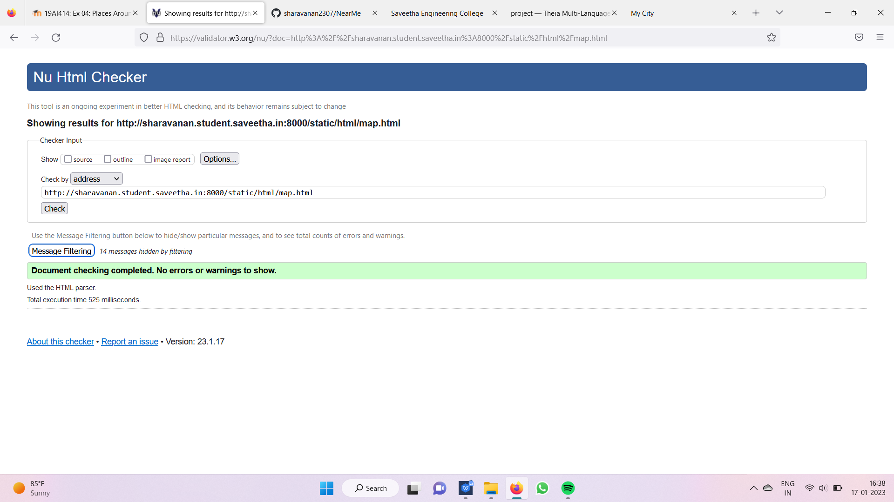

# Places Around Me
## AIM:
To develop a website to display details about the places around my house.

## Design Steps:

### Step 1:
Clone the github repository into Theia IDE

### Step 2:
Create a new django project

### Step 3:
Write the needed HTML code

### Step 4:
Run the Django server and execute the HTML files

## Code:
```
map.html
<!DOCTYPE html>
<html lang="en">
<head>
<title>My City</title>
</head>
<body>
<h1 align="center">
<font color="red"><b>Alandur</b></font>
</h1>
<h3 align="center">
<font color="blue"><b>Sharavanan S (22002718) </b></font>
</h3>
<center>

<map name="MyCity">
<area shape="circle" coords="190,50,20" href="/static/html/ghs.html" title="Govt. Higher Secondary School">
<area shape="rectangle" coords="230,30,260,60" href="/static/html/rto.html" title="RTO Office">
<area shape="circle" coords="400,350,50" href="/static/html/vk.html" title="Washerman's Lake">
<area shape="circle" coords="400,200,75" href="/static/html/bus.html" title="Hi-Tech Bus Stand">
<area shape="rectangle" coords="490,150,870,320" href="/static/html/park.html" title="Eco-Park">
</map>
</center>
</body>
</html>

bus.html
!DOCTYPE html>
<html lang="en">
<head>
<title>Bus Stand</title>
</head>
<body bgcolor="cyan">
<h1 align="center">
<font color="red"><b>Alandur</b></font>
</h1>
<h3 align="center">
<font color="blue"><b>Hi-Tech Bus Stand</b></font>
</h3>
<hr size="3" color="red">
<p align="justify">
<font face="Courier New" size="5">
<b>
Alandur is a zone of Chennai corporation, and an urban node in Chennai district in Guindy division in the state of Tamil Nadu,
India. It is Surrounded by Guindy in the North and East, Adambakkam in the South, Pazhavanthangal in the South-West and St Thomas
Mount in the North-West
</b>
</font>
</p>
</body>
</html>

ghs.html
<!DOCTYPE html>
<html lang="en">
<head>
<title>Govt. High. Sec. School</title>
</head>
<body bgcolor="lime">
<h1 align="center">
<font color="red"><b>Alandur</b></font>
</h1>
<h3 align="center">
<font color="blue"><b>Government Higher Secondary School</b></font>
</h3>
<hr size="3" color="red">
<p align="justify">
<font face="Georgia" size="5">
The main objectives of Alandur Government Higher Secondary School are 
<ul>
<li>To impart proper and qualified training to teachers and give them an attractive salary and incentives so that they are not tempted to quit and look elsewhere for jobs.</li>
<li>To provide financial aids and grants wisely and judiciously.</li>
<li>To Frame of syllabus and curriculum.</li>
<li>To set aims and objectives of education.</li>
</ul>
</font>
</p>
</body>
</html>

park.html
<!DOCTYPE html>
<html lang="en">
<head>
<title>Eco-Park</title>
</head>
<body bgcolor="yellow">
<h1 align="center">
<font color="red"><b>Alandur</b></font>
</h1>
<h3 align="center">
<font color="blue"><b>Eco-Park</b></font>
</h3>
<hr size="3" color="red">
<p align="justify">
<font face="Tahoma" size="5">
A very nice park near Alandur bus stand. It is located surrounding the Chetty Lake. 
Very superb calm place in ariyalur. Best for walking. Nice playing place for kids.
Well maintained with jogging track. Source of ground water.
Good place play with children.  In Banyan Tree lot of parrot stay like house. 
Good sound and Air. Lake view park looks awesome.
Very nice place at Alandur.
Simple and relax with play area.
</font>
</p>
</body>
</html>

rto.html
<!DOCTYPE html>
<html lang="en">
<head>
<title>RTO Office</title>
</head>
<body bgcolor="pink">
<h1 align="center">
<font color="red"><b>Alandur</b></font>
</h1>
<h3 align="center">
<font color="blue"><b>RTO Office</b></font>
</h3>
<hr size="3" color="red">
<p align="justify">
<font face="Arial" size="5">
<b>
RTO office or the Regional Transport Office is a government body specifically established to oversee all transport-related operations in the country. RTOs are located throughout the country in each state and union territory. RTOs are responsible for enforcing the rules as laid down by the Motor Vehicle Act of 1988.
The department also maintains a database of all the vehicles operating in the country as well as issues licenses for drivers. Besides, the RTO office also collects road taxes, supervises pollution checks, and ensures the enforcement of all road transportation rules. If you own or drive a vehicle in India, you will need to visit the RTO to get your vehicle registered, obtain a driver’s license or renew your driver’s license, etc.
RTOs are also responsible for improving road and vehicle safety, especially to avoid accidents and other road fatalities.
</b>
</font>
</p>
</body>
</html>

vk.html
<!DOCTYPE html>
<html lang="en">
<head>
<title>Washerman’s Lake</title>
</head>
<body bgcolor="orange">
<h1 align="center">
<font color="red"><b>Alandur</b></font>
</h1>
<h3 align="center">
<font color="blue"><b>Washerman's Lake</b></font>
</h3>
<hr size="3" color="red">
<p align="justify">
<font face="Georgia" size="5">
The uses of Washerman's Lake in Alandur  
<ol type="1">
<li>Lake is used for rain water harvesting.</li>
<li>It is used for drinking.</li>
<li>Pisculture.</li>
<li>For bathing, washing clothes etc.</li>
</ol>
</font>
</p>
</body>
</html>
```

## Output:











# HTML VALIDATOR


## Result:
The program for implementing image map is executed successfully